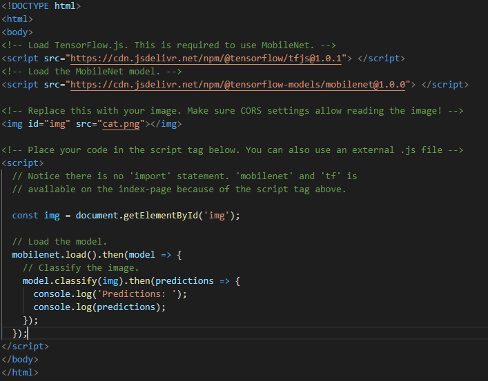
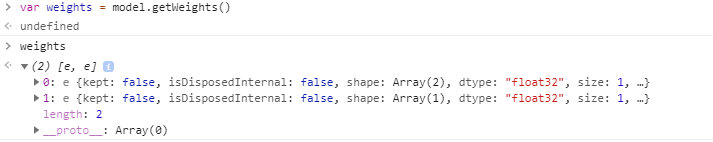
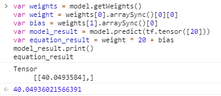
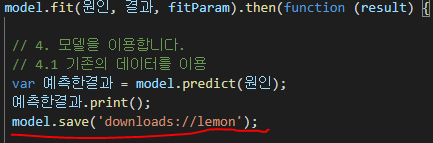
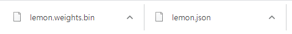
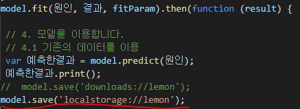
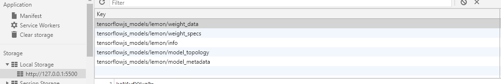
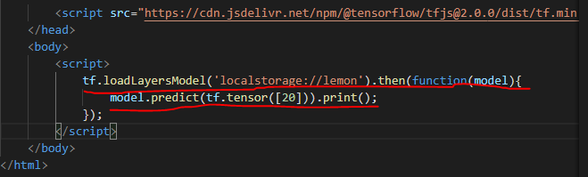
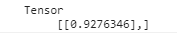

# Tensorflow.js 수업
## 지도학습 - 회귀
### 레모네이드 판매량 예측
#### 지도 학습의 순서
1. 과거의 데이터를 준비
2. 독립변수(원인)와, 종속변수(결과)의 수에 따라 모델의 모양을 만듭니다.
3. 데이터로 모델을 학습(FIT) 합니다.
4. 만든 모델을 이용합니다.

### 남의 모델 사용하기 (tensorflow)
> 

### 나의 모델 사용하기
>```javascript
>
>var 온도 = [20,21,22,23,24]
>var 판매량 = [40,42,44,46,48]
>
>var 원인 = tf.tensor(온도)
>var 결과 = tf.tensor(판매량)
>
>var X = tf.input({shape:[1]})
>var Y = tf.layers.dense({units:1}).apply(X)
>var model = tf.model({input:X, output:Y})
>var compileParam = {optimizer:tf.train.adam(), loss:tf.losses.meanSquaredError}
>model.compile(compileParam)
>
>var fitParam = {epochs:100}
>model.fit(원인,결과,fitParam).then(function(result){
>    var 다음주온도 = [15,16,17,18,19]
>    var 다음주원인 = tf.tensor(다음주온도, [다음주온도.length, 1])
>    var 다음주결과 = model.predict(다음주원인)
>    다음주결과.print()
>})
>```


### 정확도 측정
#### Epochs

- 몇번 학습 시킬 것인가를 의미하는 숫자
> ex)  
> ```javascript
> var fitParam = {epochs:100}
> ```
- change into ->
> ex)  
> ```javascript
> var fitParam = {
>    epochs:100, 
>    callbacks: {
>       onEpochEnd: 
>         function(epoch, logs) {
>           console.log('epoch', epoch, logs, 'RMSE=>', Math.sqrt(logs.loss));
>     }
>   }
>}
>```

- MSE, RMSE

## 모델의 실체
- Y = a*X+b
- a : 가중치, weight
- b : 편향, bias

### Tensor에서 값 가져오기

- weights의 첫 번째 값은 `Weights`, 가중치 두 번째 값은 `Bias`, 편향
  
  

## 모델 보관 방법
1. Node.js라는 파일을 컴퓨터에 저장
2. web browser라면 파일을 download / upload 가능
>   
>   

3. local storage 또는 indexeddb에 저장 가능
    - local storage라는 브라우저에 저장공간안에 저장가능
    - page가 리로드 되거나 또는 다른 웹페이지에서도 같은 도메인 이라면 우리가 저장한 모델을 읽어들일수 있다.
    >   
    >   
    > - load on different page with same domain  
    >   
    >   


